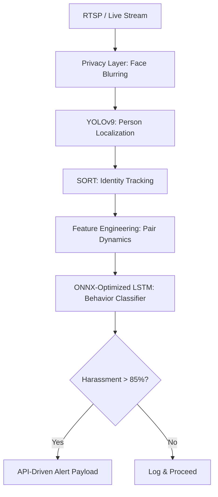

# AI-Driven Surveillance for Women’s Safety: Real-Time Physical Harassment Detection Pipeline

[](https://www.python.org/)
[](https://pytorch.org/)
[](https://github.com/ultralytics/ultralytics)
[](https://fastapi.tiangolo.com/)
[](https://onnxruntime.ai/)

This repository implements a state-of-the-art, edge-compatible AI backend designed for real-time physical harassment detection in public and private spaces. Developed as a final-year engineering project, the system combines deep-learning computer vision (YOLOv9), object tracking (SORT), and serialized temporal classification (ONNX-optimized LSTM) to build an active, privacy-preserving threat analysis pipeline.

---

## 1. Project Overview

Traditional surveillance systems rely on generic anomaly detection (e.g., detecting speed thresholds or crowds) which fails to recognize targeted interpersonal misbehavior. This system shifts the paradigm by focusing specifically on **pair-based interaction analysis**. 

Rather than assessing individuals in isolation, the backend computes dynamics between **pairs of tracked individuals** (Person A $\leftrightarrow$ Person B) over a sliding temporal window of 30 frames. This allows the system to differentiate standard public interactions from harassment patterns like cornering, pursuing, or physical aggression.

### Key Highlights
- **Privacy-Preserving**: Integrates automatic face/identity blurring layers at the pre-processing stage to safeguard citizen privacy.
- **Edge-Ready**: Optimized via ONNX Runtime to enable low-latency inference on hardware with limited resources (e.g., CPUs, edge nodes).
- **FastAPI Core**: Async endpoint design for handling high-throughput video frame ingestion.

---

## 2. System Architecture

The project features a modular design where each stage is decoupled for optimization and debugging:



* **YOLOv9**: High-accuracy object detection model used to locate human subjects in the frame. The detections are filtered to keep only the `person` class (COCO ID 0), discarding background clutter.
* **SORT (Simple Online and Realtime Tracking)**: Assigns a unique tracking identifier (`track_id`) to every localized person, maintaining identity continuity across sequential frames.
* **ONNX-Optimized LSTM**: Classifies sequential patterns of interpersonal dynamics. It takes a sliding window buffer of 30 frames of engineered features and evaluates them using a lightweight ONNX session for high-speed inference.
* **Privacy Layer**: Detects faces within bounding boxes and applies a Gaussian blur before archiving or sending data outside the local network.

---

## 3. Pipeline Flow

### Input
* A live video stream (e.g., from an RTSP camera or web stream) is decoded frame-by-frame using OpenCV.

### Processing Steps
1. **Pre-processing (Privacy Blurring)**: Raw frames undergo local face detection and blurring to ensure that no recognizable facial features are stored or processed.
2. **Detection & Tracking**: YOLOv9 detects all individuals, and the SORT tracker links these detections across frames into trajectories (e.g., `track_1` and `track_2`).
3. **Behavior Analysis**: The system maps every unique pair combination of active tracks and extracts three key interpersonal metrics:
   * **Normalized Interpersonal Distance**: The Euclidean distance between centroids, normalized by the heights of the bounding boxes to remain invariant to camera distance.
   * **Hand Intrusion Score**: The overlap ratio checking if the hand keypoints of Person A invade the torso bounding region of Person B.
   * **Arm Sync Score**: The cosine similarity of movement displacement vectors, detecting asymmetrical dynamics (e.g., one person lunging while the other recoils).

### Output
* If the LSTM output for any active pair registers a harassment probability higher than **85%**, the server triggers an immediate `AlertPayload` output.

---

## 4. Run Instructions

### Prerequisites
Make sure you have Python 3.10+ installed.

1. **Install Dependencies**:
   ```bash
   pip install -r requirements.txt
   ```

2. **Generate Synthetic Training Data** (Optional/For retraining):
   ```bash
   python -m app.modules.data_generator
   ```

3. **Train the LSTM Classifier**:
   ```bash
   python -m app.train
   ```

4. **Export the Trained Model to ONNX**:
   ```bash
   python -m app.export_onnx
   ```

5. **Start the FastAPI Server**:
   ```bash
   python -m app.main
   ```
   The API will be available at `http://localhost:8000`.

---

## 5. API Reference

### Analyze Frame
Sends a base64-encoded frame or local image path to the server for real-time analysis.

* **URL**: `/api/v1/analyze`
* **Method**: `POST`
* **Content-Type**: `application/json`

#### Request Payload
```json
{
  "frame_id": "frame_00042",
  "base64_image": "/9j/4AAQSkZJRgABAQEASABIAAD...",
  "camera_id": "cam_lobby_01"
}
```

#### Response (Harassment Detected)
```json
{
  "frame_id": "frame_00042",
  "detections": [
    {
      "detection_class": "normal",
      "confidence": 0.89,
      "bounding_box": {
        "x_min": 120.0,
        "y_min": 80.0,
        "x_max": 250.0,
        "y_max": 380.0
      },
      "track_id": 1
    },
    {
      "detection_class": "normal",
      "confidence": 0.91,
      "bounding_box": {
        "x_min": 140.0,
        "y_min": 90.0,
        "x_max": 270.0,
        "y_max": 395.0
      },
      "track_id": 2
    }
  ],
  "alert": {
    "alert_id": "alert_c39b1a52de8f",
    "frame_id": "frame_00042",
    "camera_id": "cam_lobby_01",
    "severity": "high",
    "harassment_confidence": 0.925,
    "detections": [...],
    "message": "⚠️ Harassment detected with 93% confidence on camera cam_lobby_01.",
    "triggered_at": "2026-06-25T08:22:41.917Z"
  },
  "processed_at": "2026-06-25T08:22:41.917Z"
}
```

---

## 6. Future Scope

* **Edge Deployment**: Compiling the YOLOv9 detector and the SORT tracker to tensor processing formats (like TensorRT) for single-board computers such as the **NVIDIA Jetson Nano** or **Raspberry Pi 5** equipped with an AI accelerator.
* **Audio-Visual Fusion**: Integrating ambient microphones to capture and combine sound anomalies (screams, glass breaking) with the spatial LSTM model to minimize false positives.
* **Expanded Action Grammars**: Expanding the classification sequence library to cover verbal harassment cues and complex physical boundaries.
